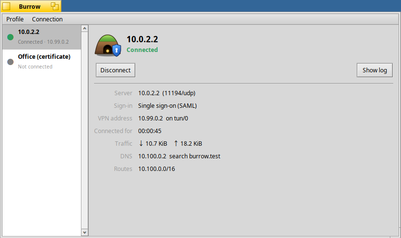

# Burrow

A native Haiku VPN client for **AWS Client VPN** and other OpenVPN servers.
It does what the AWS-provided client does on Windows, macOS and Ubuntu,
including AWS single sign-on through your web browser.



- Imports the `.ovpn` profile from the AWS console ("Download client configuration")
  or any OpenVPN client profile. You can use the file panel, drag and drop, or open
  it from Tracker.
- **Single sign-on (SAML):** opens your identity provider in WebPositive, receives
  the sign-in on `127.0.0.1:35001` like AWS's client does, and finishes the connection.
- **Certificate** (mutual TLS) and **user name / password** (Active Directory) profiles,
  including static and dynamic challenges.
- Shows state, VPN address, time connected, traffic, DNS and routes. It applies the
  VPN's name servers while connected and restores them afterwards.
- Split and full tunnel. Several profiles can be connected at once.
- Lives in the Deskbar tray: connect and disconnect from its menu. Closing the window
  keeps connections up.
- Scriptable: `Burrow --connect "Name"`, `--disconnect "Name"`, `--disconnect-all`.

The official AWS client is closed-source .NET and GTK and cannot be ported. Its VPN
part is a patched OpenVPN, which Burrow builds from source for Haiku as
`burrow-openvpn` (see [openvpn/SOURCE.md](openvpn/SOURCE.md)). Burrow drives that
build through OpenVPN's management interface.

<!-- airos-ci:latest-builds:start -->
## Latest builds

Built automatically by air/OS CI from commit `312eaf9` on 2026-10-05 ([all files](https://github.com/jmgasper/burrow/releases/tag/latest)).

| Architecture | Package |
|---|---|
| arm64 | [burrow-0.1.0.alpha-2-arm64.hpkg](https://github.com/jmgasper/burrow/releases/download/latest/burrow-0.1.0.alpha-2-arm64.hpkg) |
| x86_64 | [burrow-0.1.0.alpha-2-x86_64.hpkg](https://github.com/jmgasper/burrow/releases/download/latest/burrow-0.1.0.alpha-2-x86_64.hpkg) |

Install with `pkgman install <file>`, or copy the file into `/boot/system/packages`. Haiku SDK: x86_64 hrev60206-669-g9dc439ceeb, arm64 hrev60206-669-g9dc439ceeb.
<!-- airos-ci:latest-builds:end -->

## Status

Alpha. It has been tested end to end in a Haiku R1/beta6 x86_64 VM against a stand-in
AWS endpoint (`tools/fake-endpoint`). The tests covered SAML sign-in in WebPositive,
split and full tunnel, certificate auth, DNS, and reconnects. It has **not yet been
tested against a real AWS Client VPN endpoint.**

Known limits:

- Programs that were already running before you connect keep their old name servers:
  Haiku's resolver reads `resolv.conf` once per process. Restart the browser after
  connecting if VPN host names do not resolve. A fix belongs in the Haiku fork; see
  [docs/ARCHITECTURE.md](docs/ARCHITECTURE.md).
- Not implemented: AWS "client route enforcement", device posture checks, encrypted
  private keys, per-domain (split) DNS.

## Build

On Haiku, with `lzo_devel lz4_devel libtool` installed (`openssl3_devel` and the
compiler come with Haiku):

```sh
make            # build-haiku/Burrow
make openvpn    # build-haiku/openvpn/burrow-openvpn
make check      # core tests (tests/fake-openvpn.py needs python3)
make check-ui   # native dialog layout checks (requires app_server)
make package    # artifacts/burrow-<version>-x86_64.hpkg
```

The UI checks exercise long profile names and authentication challenges at
12- and 18-point fonts, empty-name validation, and the log window. They do not
connect to a VPN or read saved profiles.

On Linux, `make BUILD=build-host check-host` builds and runs the core tests.

For the ROCK 5 ITX (Haiku arm64), `bash tools/build-arm64.sh` cross-builds on the
Linux workstation with the fork's arm64 toolchain and Summit's arm64 sysroot. It
produces `artifacts/burrow-<version>-arm64.hpkg`. That build links OpenSSL
statically and leaves out LZO/LZ4 compression (the board has no packages for
them, and AWS does not use them), so it only requires Haiku. The ROCK has no
battery-backed clock that Haiku reads: if it boots into 1970, TLS rejects the VPN
server's certificate. Run `/system/preferences/Time --update` (or **Synchronize now**
in Time preferences) before connecting.

Development uses a Haiku VM (see [docs/VM.md](docs/VM.md)): `bash tools/sync-build.sh`.
For a VPN to connect to, `bash tools/fake-endpoint.sh start` runs the stand-in AWS
endpoint in Docker (see [tools/fake-endpoint/README.md](tools/fake-endpoint/README.md)).

## License

Burrow is MIT-licensed (see [LICENSE](LICENSE)). `burrow-openvpn` is OpenVPN,
GNU GPL v2. Its patches and build script ship in the package's documentation folder.
